# 🛱 CSI Channel Estimation with Deep Learning

This project benchmarks lightweight deep learning models (3D CNN, LSTM, Transformer) for CSI (Channel State Information) estimation in MIMO systems. It compares the performance with traditional MMSE under synthetic Rayleigh and DeepMIMO-generated channels.

---

## 🧠 Project Highlights

* 📶 **Supports both synthetic Rayleigh and DeepMIMO ray-tracing datasets**
* 🧹 **Implements 3 model types**: 3D CNN, LSTM, Transformer
* 🧪 **Compares with MMSE baseline** under realistic noise & distortion
* 📊 **Includes visualizations**: heatmaps, per-antenna comparisons, loss curves
* ⚙️ **Benchmarking on CUDA inference time**: practical deployment focus

---

## 🖐 System Model

We estimate the MIMO channel matrix `H` using pilot signals `x`, with the received signal `y`:

```
y = H · x + n
```

Where:

* `x`: known pilot symbol, shape `(N_tx × L)`
* `y`: received signal at RX, shape `(N_rx × L)`
* `H`: channel tensor, shape `(N_rx × N_tx × L × 2)` where the last dim is \[real, imag]
* `n`: additive white Gaussian noise

Each training sample represents **a single CSI frame**, consisting of `L=8` pilot subcarriers (not time steps), following real-world CSI-RS usage in OFDM.

---

## 🧪 Channel Data & Augmentations

### Synthetic Rayleigh Channel

* Each element `h_{i,j}` \~ `CN(0, 1)`
* i.i.d. fading with no TX/RX correlation
* Simulates a "white" channel — ideal for testing generalization

### DeepMIMO (O1\_60)

* Geometry-based ray-tracing CSI from real-world layout
* Inherent **TX/RX correlation**, shared multi-path structure
* Useful to test model's ability to extract structured features

### Data Preprocessing & Augmentations

* Random SNR between 10–30 dB
* Random Zadoff-Chu pilot root index
* Optional IQ imbalance simulation
* 1-bit quantization noise (optional)

---

## 🧠 Models Implemented

| Model               | Description                                  |
| ------------------- | -------------------------------------------- |
| `SimpleCSINet3D`    | 3D CNN over (rx, tx, pilot), \~80K params    |
| `LSTMCSINet`        | Models pilot as a sequence, uses LSTM layers |
| `TransformerCSINet` | Uses attention across subcarriers            |

All models take input:

```
x_input: (batch, 4, N_rx, N_tx, L)  # 4 channels = [x_real, x_imag, y_real, y_imag]
```

Output:

```
Ĥ: (batch, N_rx, N_tx, L, 2)
```

---

## 📈 Experimental Findings

* ✅ **CNN consistently outperformed MMSE** in both accuracy and latency
* ❌ **LSTM & Transformer prone to instability** due to:

  * Lack of temporal structure
  * Overfitting via unstable attention
* ✅ **CNN fastest on CUDA** (0.36ms/sample)
* 🧨 **Dropout disabled → faster convergence** (data is clean enough)
* 📱 **DeepMIMO training more effective than Rayleigh** due to spatial correlation

---

## 🔍 Visualization Results

| Dataset  | Model       | Loss Curve                                      | Heatmap                                       | 1-sample Comparison                                     |
| -------- | ----------- | ----------------------------------------------- | --------------------------------------------- | ------------------------------------------------------- |
| Rayleigh | CNN         | 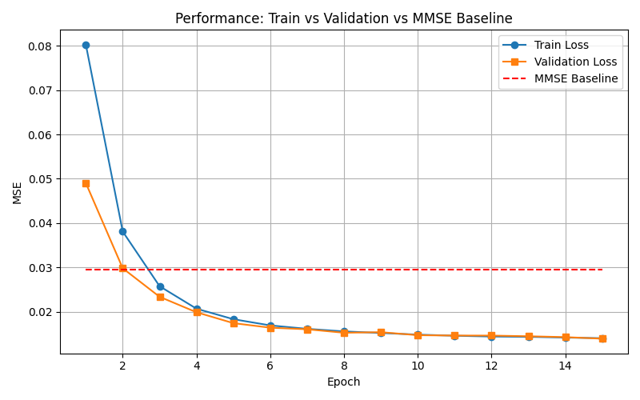         | 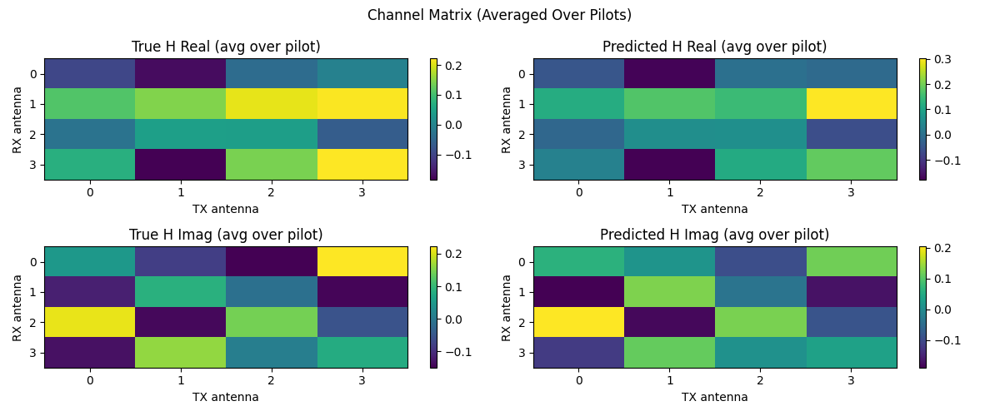         | 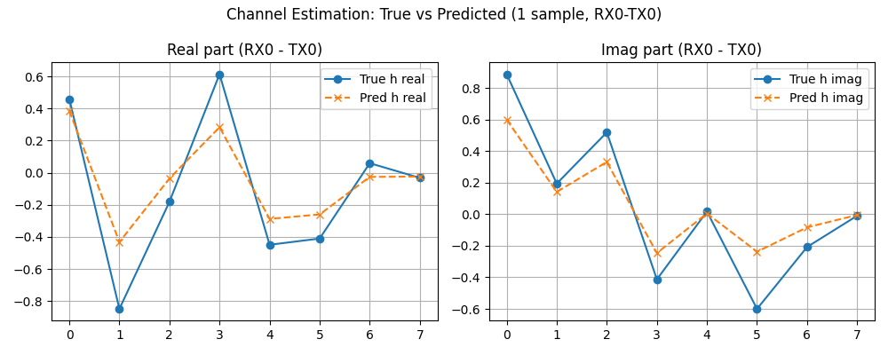         |
| Rayleigh | LSTM        | 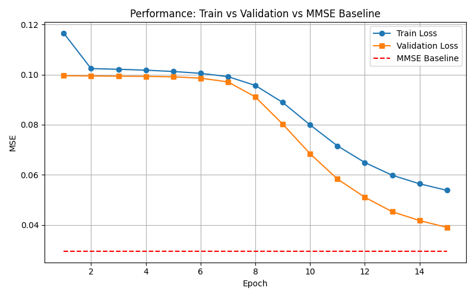        | 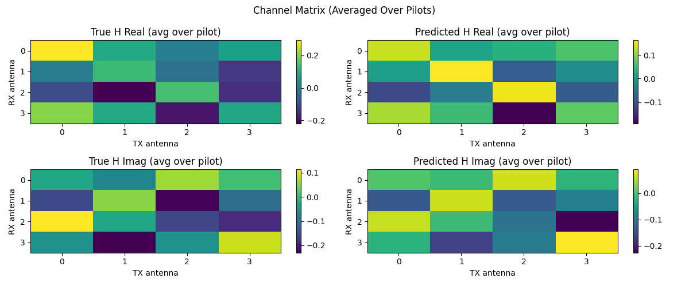        | 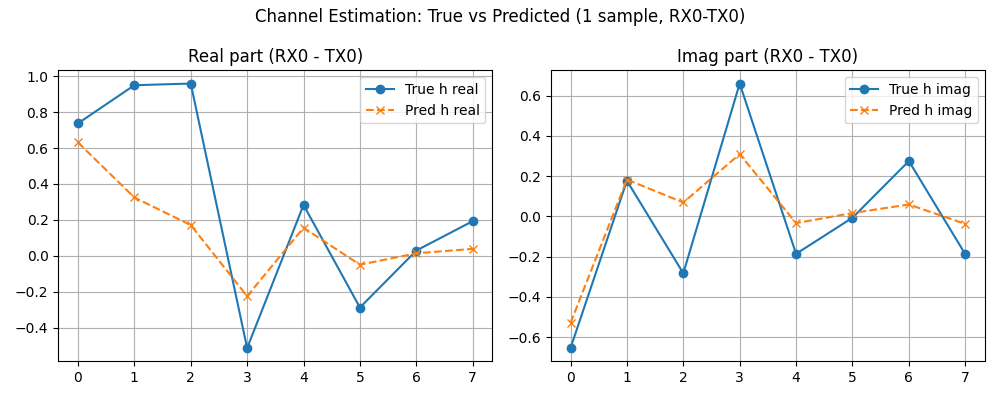        |
| Rayleigh | Transformer | 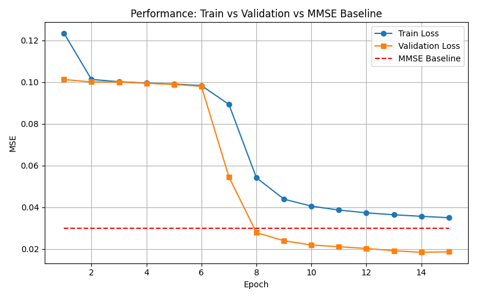 | 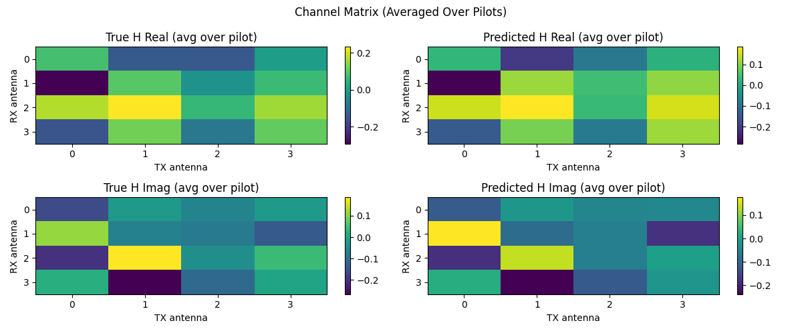 | 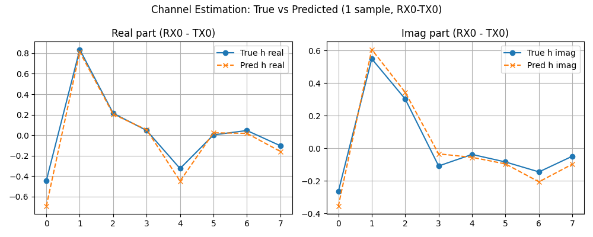 |
| DeepMIMO | CNN         | 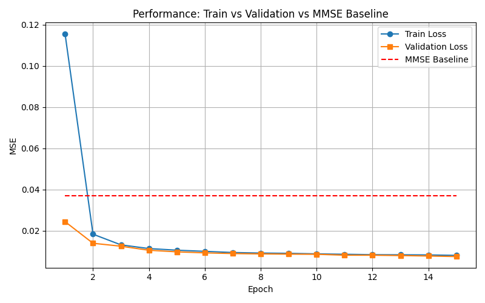         | 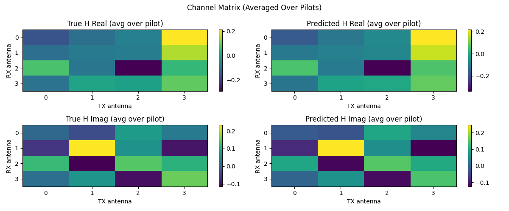         | 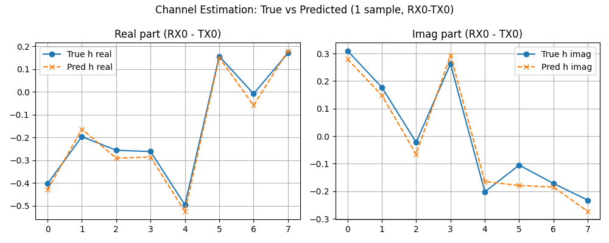         |
| DeepMIMO | LSTM        | 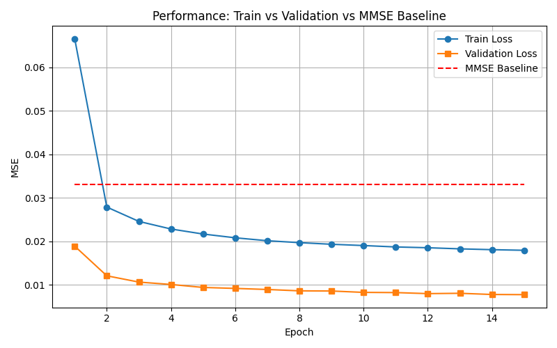        | 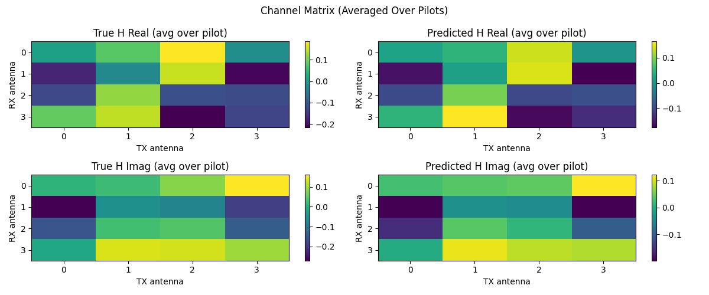        | 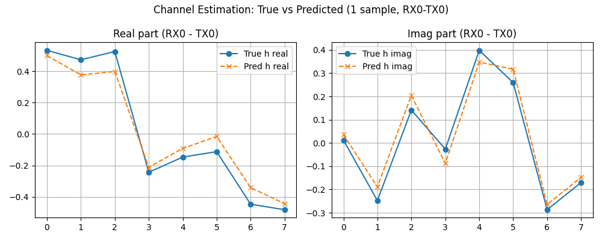        |
| DeepMIMO | Transformer | 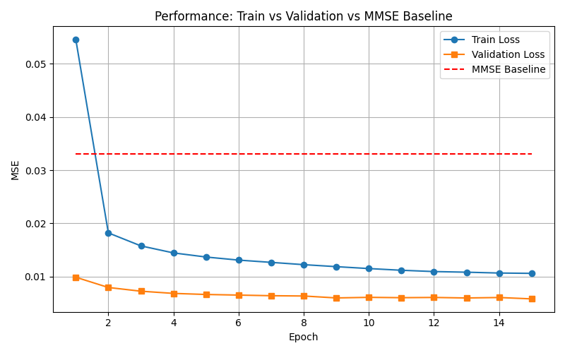 | 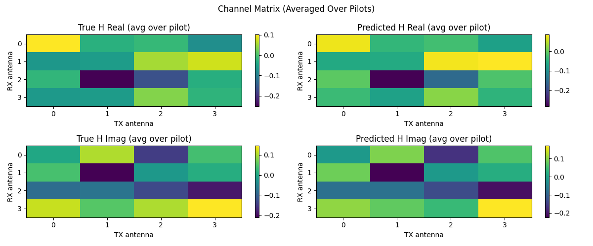 | 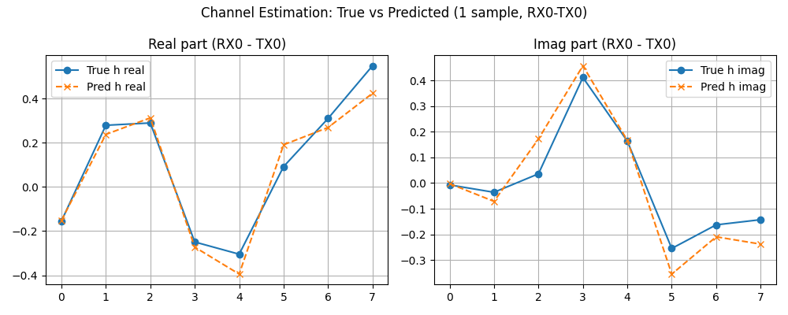 |

---

## 🔬 Inference Benchmark (CUDA)

| Model       | Batch Size | Inference Time (ms) |
| ----------- | ---------- | ------------------- |
| CNN         | 1          | 0.369               |
| LSTM        | 1          | 0.439               |
| Transformer | 1          | 0.828               |
| CNN         | 32         | 0.499               |
| LSTM        | 32         | 0.848               |
| Transformer | 32         | 1.137               |

---

## 📁 Project Structure

```
CSI_Estimator_With_MMSE/
├── main.py                # Training & evaluation pipeline
├── model.py               # CNN / LSTM / Transformer model definitions
├── dataset.py             # CSI dataset loader (Rayleigh / DeepMIMO)
├── mmse_baseline.py       # MMSE estimator baseline
├── config.py              # Centralized config parameters
├── generate_deepmimo.py   # DeepMIMO CIR -> H data converter
├── run_all_combinations.py  # Run 3×2 experiments & auto-save plots
├── README.md              # This file
├── .gitignore             # Git-ignored patterns
└── (ignored files & folders)
    ├── deepmimo_data.pkl         # Converted DeepMIMO data
    ├── *.mat, *.pkl, *.pt        # Large data or model weights
    ├── results/                  # Output images & logs
    ├── __pycache__/             
    └── myenv310/                # Virtual environment
```

> ⚠️ `.pkl`, `.mat`, `myenv310/`, `__pycache__/`, `archive/` are git-ignored

---

## 🚀 How to Run

Install dependencies:

```bash
pip install torch numpy matplotlib
```

Run training:

```bash
python main.py
```

Use DeepMIMO:

```bash
python generate_deepmimo.py
```

---

## 👨‍💻 Author

**Wang Chen Han（王振翰）**
5G PHY Algorithm Engineer @ MediaTek
GitHub: [https://github.com/HankWang-WL](https://github.com/HankWang-WL)
Email: [hank851107@gmail.com](mailto:hank851107@gmail.com)
