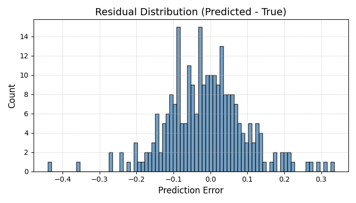
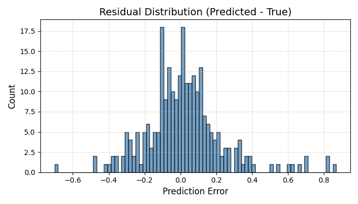
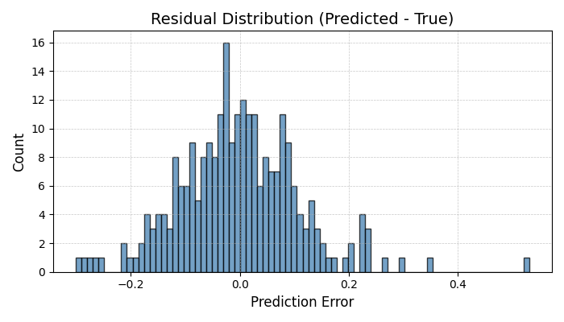
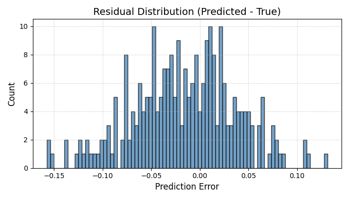
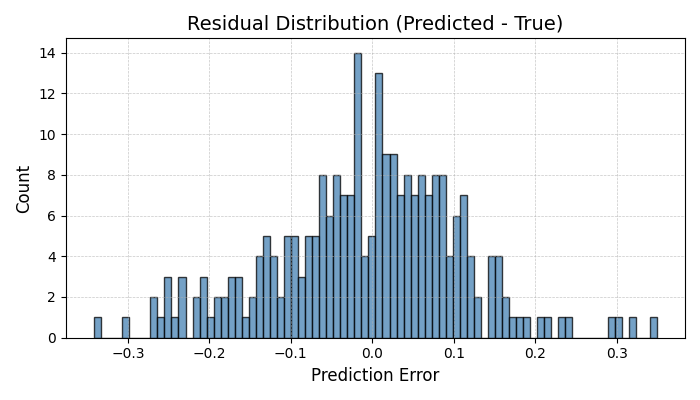
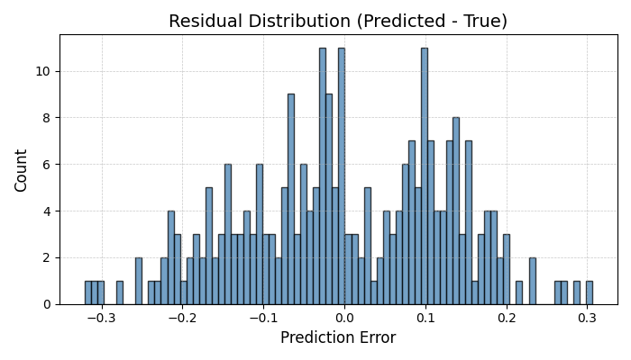

# 🛱 CSI Channel Estimation with Deep Learning

Channel State Information (CSI) estimation in MIMO systems using lightweight deep learning models. Unlike typical approaches relying solely on off-the-shelf datasets and standard model architectures, this project was developed entirely from scratch—from dataset generation and preprocessing to customized neural network design and optimized inference pipelines.  
Specifically, I implemented compact neural networks (3D CNN, LSTM, Transformer) tailored explicitly for estimating the channel matrix (H) from known pilot signals. Through extensive experiments, data augmentations, and realistic hardware impairments, these models consistently outperformed traditional MMSE estimators. Evaluations covered both synthetic i.i.d. Rayleigh fading channels and realistic DeepMIMO ray-tracing scenarios, demonstrating exceptional model generalization and robustness under diverse real-world conditions.


---

## 🧠 Project Highlights

* 📶 **Multiple Channel Scenarios**: Supports synthetic Rayleigh fading (uncorrelated i.i.d. channels) and DeepMIMO ray-tracing data (real-world geometry with spatial correlation). This tests the models on both idealized and real-world channel characteristics.
* 🧹 **Three Model Architectures**: Implemented 3D CNN, LSTM, and Transformer based estimators (each \~18K parameters) to learn CSI mapping from pilots.
* 🧪 **MMSE Baseline Comparison**: Benchmarked against a traditional MMSE channel estimator under realistic conditions (varying SNR, hardware impairments) to quantify gains.
* ⚡ **Deployment Focus**: Measured CUDA GPU inference time for each model (batch size 1 and 32) to assess real-time deployment feasibility.
* 🚀 **TensorRT Deployment Pipeline**: Exported the CNN model to ONNX and compiled a `.engine` using TensorRT (FP16, SM61 compatibility). Completed full inference with custom bindings, memory setup, and latency benchmark under edge-device constraints.
* 📈 **Rich Visualizations**: Includes training loss curves, channel heatmaps (true vs. predicted H), and residual histograms of estimation error. These help interpret model performance per antenna and overall error distribution.

---

## 🧩 Design Highlights & Summary

This project demonstrates that a lightweight **2-layer 3D CNN** is sufficient to outperform traditional MMSE estimators and deeper models like LSTM and Transformer in both accuracy and inference time. The CNN architecture is carefully selected for:

- **Practical Deployability**: With only two 3D convolutional layers and a final 1×1×1 output convolution, the model remains extremely lightweight and well-suited for edge deployment.  
  **Among all models, CNN has the fewest parameters (~18K), significantly reducing memory and computation requirements.**

- **Architecture Comparison**:
  - **CNN**: 2 Conv3D layers + ReLU + final Conv3D(1×1×1)
  - **LSTM**: 2-layer LSTM + 1 FC layer
  - **Transformer**: 2 Transformer encoder blocks + 1 FC layer

After extensive benchmarking, the CNN-based estimator emerges as the best choice:

- ✅ Lowest validation MSE across both Rayleigh and DeepMIMO channels  
- ✅ Fastest inference speed on GPU (0.37ms at batch=1)  
- ✅ Strong generalization even under varying SNR and channel conditions  
- ✅ Smallest model size (~18K parameters), ideal for edge or embedded deployment

This shows that a well-designed, compact CNN architecture not only simplifies deployment but also delivers state-of-the-art performance.

---
## 🖐 System Model

We aim to estimate the MIMO channel matrix **H** using known pilot **x** and observed signal **y** under AWGN:

```
y = H · x + n
```

Where:

- **x**: known pilot symbols, shape `(N_tx × L × 2)` — includes real and imaginary parts  
- **y**: received signal, shape `(N_rx × L × 2)` — includes real and imaginary parts  
- **H**: channel matrix, shape `(N_rx × N_tx × L × 2)` — complex-valued channel coefficients  
- **n**: additive white Gaussian noise

Each training sample represents a single CSI frame – we use L = 8 pilot subcarriers (spanning 8 frequencies in one OFDM symbol, similar to 5G NR CSI-RS patterns). Internally, the real and imaginary parts of 𝑥 and 
𝑦 are separated and stacked as 4 input channels. The model learns to predict **Ĥ** (estimated H) from the input pair (x, y).

*Intuition*: The channel matrix H describes how each transmit antenna’s signal propagates to each receive antenna. Our neural networks learn to recover this matrix from the distorted pilot signals received, effectively learning the complex gain and phase introduced by the channel.

---

## 🌐 Channel Modeling: Rayleigh vs DeepMIMO

| Feature            | Rayleigh Channel                  | DeepMIMO (O1\_60)                          |
| ------------------ | --------------------------------- | ------------------------------------------ |
| Fading Model       | i.i.d. Complex Gaussian `CN(0,1)` | Ray-traced from real-world geometry        |
| Multi-path effect  | No (single tap)                   | Yes (multiple paths with delay & AoA/AoD)  |
| TX/RX correlation  | None                              | Present due to spatial layout              |
| Temporal diversity | No (flat response across pilots)  | Yes (each pilot gets distinct path phases) |
| Structure          | Uncorrelated, unstructured        | Geometrically constrained, structured      |
| Use case           | Baseline sanity test              | Realistic deployment setting               |
### 🔬 Power Delay Profile (PDP) Characteristics

**Rayleigh channel** is generated with exponential decay per tap:

```
h_l ~ CN(0, σ² · e^(–α·l))
```

**DeepMIMO channel** aggregates multiple geometric paths:

```
H(f) = Σₚ √(Pₚ) · e^(–j·2π·f·τₚ) · e^(j·ϕₚ) · a_rxₚ · a_txₚᴴ
```

Where:

* Pₚ: power of the p-th propagation path
* τₚ: delay of the p-th path
* ϕₚ: random phase shift of the p-th path
* a\_rxₚ: receive array steering vector
* a\_txₚᴴ: transmit array steering vector (Hermitian)

To introduce diversity across pilots, each path is perturbed with:

* random carrier frequency phase
* AoA/AoD steering response

This makes each subcarrier carry **distinct spatial features**, allowing learning-based models to outperform MMSE.


---

## 🧪 Channel Data & Augmentations

We evaluate on two types of channel datasets, with on-the-fly augmentations to simulate real conditions:

* **Synthetic Rayleigh Fading**: Each channel coefficient `h_{i,j} ~ CN(0,1)` (complex Gaussian). All antenna pairs are i.i.d. with no correlation – essentially a "white noise" channel. This provides a simple, uncorrelated scenario to test generalization.

* **DeepMIMO Ray-Tracing (O1\_60)**: Channels generated from a 3D ray-tracing scenario (DeepMIMO dataset). Multipath propagation and environment geometry create inherent TX/RX spatial correlation and structured channel taps. This represents a realistic urban microcell, challenging the model to exploit correlation and structure in the channel.

* **Augmentations & Impairments**: To improve realism and robustness, each training sample applies random conditions:

  * **Random SNR (Signal-to-Noise Ratio)**: Uniform between 10–30 dB for each sample, adding appropriate noise power.
  * **Random Pilot Sequence**: Uses Zadoff-Chu sequences with a random root index for each sample (simulating different pilot designs).
  * **IQ Imbalance (optional)**: Can simulate transmitter/receiver IQ gain-phase imbalance on the signals.
  * **4-bit Quantization Noise (optional)**: Quantize the input signal to 4-bit resolution to simulate ADC constraints.


These augmentations ensure the models are exposed to a variety of conditions and are not overfitting to ideal scenarios.

---

## 🧠 Models Implemented

| Model                 | Description                                                                                                           | Parameter Count |
| --------------------- | --------------------------------------------------------------------------------------------------------------------- | --------------- |
| **SimpleCSINet3D**    | 3D CNN that processes input as a volume across (Rx, Tx, pilots). Fast and effective for spatial features.             | 🏆**18,490**      |
| **LSTMCSINet**        | Treats pilots as sequential input. Captures frequency correlation. Best when channel response has structure across L. | 235,552         |
| **TransformerCSINet** | Uses self-attention across pilot subcarriers. Learns global relationships among antennas and subcarriers.             | 537,760         |

**Input Format**: Each model receives input of shape `(batch, 4, N_rx, N_tx, L)`, where the 4 channels represent `[x_real, x_imag, y_real, y_imag]`. Real and imaginary parts of pilot and received signals are stacked along the channel dimension.

**Output Format**: The model outputs a predicted channel tensor Ĥ of shape `(batch, N_rx, N_tx, L, 2)`, where the last dimension contains the real and imaginary components of the estimated channel matrix. 

Conclusion:
Among all models, the 3D CNN has the lowest parameter count (18K) while achieving the best trade-off between accuracy and latency. This lightweight nature makes it ideal for real-time CSI estimation and hardware deployment, especially under edge-device constraints.

---

## 📊 Results & Visualizations

Below we present training results on both Rayleigh and DeepMIMO datasets for each model. We include:

- **Loss Curves**: Training vs. validation MSE loss across epochs. The dotted line indicates MMSE baseline.
- **Heatmaps**: Visual comparison of true vs. predicted channel magnitudes for a selected sample.
- **Residual Histograms**: Distribution of the element-wise difference between predicted and true channels.

| Dataset  | Model       | Loss Curve                                      | Heatmap                                       | Residual Histogram                                      |
| -------- | ----------- | ----------------------------------------------- | --------------------------------------------- | ------------------------------------------------------- |
| Rayleigh | CNN         |          |          |          |
| Rayleigh | LSTM        |         |         |         |
| Rayleigh | Transformer |  |  |  |
| DeepMIMO | CNN         |          |          |          |
| DeepMIMO | LSTM        |         |         |         |
| DeepMIMO | Transformer |  |  |  |

**Figure Interpretation**:

- In **loss curves**, a lower validation loss indicates better generalization. Dotted horizontal lines indicate MMSE baseline loss.
- In **heatmaps**, more similar color patterns between prediction and ground truth imply better spatial reconstruction.
- In **residual histograms**, an ideal model shows error distribution centered at 0 with tight spread (low variance).

### 📋 Performance Summary Table (Val MSE vs MMSE)

| Dataset  | Model       | Val MSE ↓  | MMSE MSE (Baseline) | Notes                                                                                   |
|----------|-------------|------------|----------------------|-----------------------------------------------------------------------------------------|
| Rayleigh | **CNN**     | **0.0144** | 0.0297               | Best overall on Rayleigh; clean and stable convergence.                                 |
| Rayleigh | LSTM        | 0.0391     | 0.0295               | Underfits; sequential modeling ineffective for uncorrelated i.i.d. channels.            |
| Rayleigh | Transformer | 0.0186     | 0.0298               | Improved performance after epoch 7; good generalization.                                |
| DeepMIMO | **CNN**     | **0.0075** | 0.0369               | 🏆 **Best overall** (5× lower MSE than MMSE); highly effective at exploiting correlation.|
| DeepMIMO | LSTM        | 0.0195     | 0.0373               | Performs reasonably well but less consistent than Transformer.                          |
| DeepMIMO | Transformer | 0.0130     | 0.0375               | Strong results; benefits from structured multipath diversity.                           |

➡️ Across all evaluations, the 3D CNN consistently outperforms both LSTM and Transformer in accuracy and latency, making it the most practical choice for real-world deployment.

### 🎯 Model Selection Insight

💡 **Key Takeaways**

- **LSTM Underfits (Not Overfitting)**  
  The LSTM model shows validation loss lower than training loss in both Rayleigh and DeepMIMO scenarios, indicating no overfitting. Instead, it likely underfits due to an architecture-data mismatch:  
  - The Rayleigh channel has no sequential structure (each subcarrier fading is independent), so LSTM’s time-series modeling offers little benefit.  
  - Aggressive dropout further reduces capacity, leading to under-utilization of the model.

- **Transformer Shows Delayed Gain**  
  The Transformer model often plateaus early (e.g., Rayleigh), then improves significantly after ~7–8 epochs. This suggests attention weights need more time to adapt.  
  - In DeepMIMO (with more inherent structure), Transformer converges smoothly and consistently outperforms LSTM.

- **3D CNN Excels**  
  Emerges as the best performer across both datasets. Achieves lowest MSE with stable, fast convergence.  
  - Especially in DeepMIMO, CNN reduces MSE from MMSE's 0.0369 to 0.0075 — nearly **5× lower**, showing strong ability to capture spatial-frequency features.

- **Dropout Impact**  
  Dropout layers in CNN caused a noticeable train–val gap.  
  - Removing dropout led to tighter convergence and better generalization, suggesting models weren’t overfitting and regularization was unnecessary.


---
### ✅ Future Improvements (Action Items)

- **ResNet-based Estimator**  
  Experiment with a ResNet-style deep CNN to explore whether skip connections can further improve estimation accuracy.

- **Longer Pilot Sequences**  
  Evaluate model robustness using longer pilot lengths (more subcarriers or time slots). This may allow LSTM/Transformer to leverage true sequential structure more effectively.

- **More DeepMIMO Scenarios**  
  Test on additional DeepMIMO scenes (e.g., O1_28, O2_60) to confirm generalization across different spatial layouts and carrier frequencies.

- **Transformer Tuning**  
  Adjust Transformer hyperparameters (e.g., insert LayerNorm, increase depth) to potentially close the performance gap with CNN on Rayleigh channels.

- **TensorRT Plugin Optimization**  
  Explore custom TensorRT plugins (e.g., fused 3D convolution + ReLU) to reduce inference overhead on low-end GPUs like GTX1060.

- **Quantization & FP16/INT8 Deployment**  
  Explore FP16 and INT8 post-training quantization to reduce latency and memory footprint, enabling real-time CSI estimation on edge devices.

---
## 🔬 Inference Time (CUDA, batch size = 1/32)
We benchmarked the models' forward-pass inference latency on a single NVIDIA GPU (PyTorch, FP32). Even with similar parameter counts, architecture differences affect speed:
| Model       | Inference Time (ms) |
| ----------- | ------------------- |
| CNN         | 0.37 / 0.50         |
| LSTM        | 0.44 / 0.85         |
| Transformer | 0.83 / 1.13         |

Notes: The CNN is fastest, especially at batch=32 where it likely benefits from convolution parallelism. The Transformer is relatively slower due to attention computation overhead, which grows with sequence length (L=8 here is small, but still noticeable). LSTM is in between, but doesn’t scale as well to batch processing as CNN.

**Conclusion**: CNN achieves the best trade-off between speed and accuracy, especially under batched inference conditions.

## 🚀 TensorRT Inference Deployment (CNN only)

To further demonstrate deployment feasibility, we convert the trained CNN model to a TensorRT engine on a **GTX 1060 (3GB)** using NVIDIA’s inference toolkit.

       [ DeepMIMO Data (.pkl) ]
                  ↓
       [Data Loader: CSIDataset]
                  ↓
      [x, y] + [Ground Truth H]
                  ↓
             Trained CNN              
                  ↓                     
           Export to ONNX               
                  ↓                     
     Build TensorRT Engine (.engine)    
                  ↓                     
        Inference with TensorRT         
                  ↓                     
       Save CNN TorchRT Latency
### 📤 Export to ONNX

The trained CNN model is exported to ONNX format via:

```python
torch.onnx.export(model, dummy_input, "cnn_model.onnx", export_params=True, opset_version=11)
```

### 🛠️ Build TensorRT Engine

We then convert it using TensorRT 8.6.1 (Windows, CUDA 12):

```bash
trtexec --onnx=cnn_model.onnx --saveEngine=cnn_model.engine --explicitBatch
```

The resulting `.engine` file is optimized for the target hardware (GTX1060 SM61).
Inference script handles shape, format, and memory bindings with the TensorRT Python API.

### 📉 Inference Latency (TensorRT, CNN only)

| Framework | Batch Size | Latency (ms) |
| --------- | ---------- | ------------ |
| TensorRT  | 1          | **1.86**     |
| TensorRT  | 32         | **1.36**     |

> ⚠️ Only the CNN model is exported to TensorRT due to its lightweight structure.
> LSTM and Transformer are not deployed due to ONNX export instability and complexity in sequential/attention modeling.

This confirms CNN’s suitability for **real-time CSI estimation** under edge-device constraints.
The full deployment pipeline was implemented with reference to NVIDIA official documentation and manually adapted for inference compatibility (e.g., input formatting, output reshaping, memory bindings).

Although TensorRT typically accelerates inference significantly, the measured latency on GTX 1060 (SM61) was slightly higher compared to native PyTorch inference. This performance drop is primarily due to the GTX 1060's limited hardware acceleration for FP16 operations, Python API binding overhead, and the simplicity of the CNN model (fewer optimization opportunities). On newer GPUs with enhanced Tensor Core support, TensorRT inference is expected to substantially outperform PyTorch.


🔧 Note: The full TensorRT deployment code is omitted from GitHub due to hardware-specific configurations (GTX 1060 SM61, CUDA 12). The benchmark results are provided for reference only.

---

## ⚠️ Challenges & Solutions

Throughout the CSI estimation project, several technical issues arose during data preprocessing, model training, and deployment phases. The following summarizes the major challenges and corresponding solutions that were critical to achieving successful implementation and robust inference results:

### 1️⃣ DeepMIMO Version Compatibility Issues

- **Challenge:**  
  The dataset generated using **DeepMIMO v3** was consistently empty or incorrect, despite numerous attempts to extract and reshape the underlying `.mat` file data.

- **Solution:**  
  A detailed examination of published papers and forums revealed widespread use of **DeepMIMO v2** for CSI estimation benchmarks. Switching to v2 immediately resolved data extraction problems and produced valid training datasets.

> **Lesson Learned:**  
> Always verify dataset versions referenced in literature or benchmarks, as subtle dataset version differences can significantly affect output.

---

### 2️⃣ Complex Preprocessing and Data Verification (DeepMIMO)

- **Challenge:**  
  DeepMIMO dataset features complex nested arrays and physical channel parameters (e.g., AoA/AoD, delays, power profiles). Initial preprocessing attempts frequently resulted in shape mismatches or physically incorrect channels, severely impacting training effectiveness.

- **Solution:**  
  - Implemented a custom `.mat` file inspection script (`generate_deepmimo.py`) for accurate visualization of internal data structures.
  - Conducted iterative reshaping validation and sanity checks (e.g., Power Delay Profile visualization) ensuring physical correctness prior to ML model ingestion.

> **Lesson Learned:**  
> Comprehensive data verification and structured preprocessing are essential, especially with physically realistic datasets. Incremental validation prevents subtle but severe errors downstream.

---

### 3️⃣ Enhancing ML Performance Beyond MMSE Baseline

- **Challenge:**  
  Initial ML training consistently underperformed against the MMSE baseline, particularly on the simplistic synthetic Rayleigh channel, which lacked structured spatial correlation.

- **Solution:**  
  - Transitioned to **DeepMIMO** ray-traced channels, introducing spatial structure exploitable by neural networks.
  - Applied realistic data augmentation and impairments:
    - **Randomized SNR levels** (10–30 dB range)
    - Simulated **4-bit quantization noise** (ADC limitations)
    - Randomized **IQ imbalances** (amplitude & phase shifts)
    - Varied **pilot sequence indices** (Zadoff-Chu roots)
  
  These augmentations increased training difficulty yet substantially boosted generalization and performance.

> **Lesson Learned:**  
> Introducing realistic impairments and structured variability forces ML models to generalize more effectively, enabling significant improvements over classical benchmarks like MMSE.

---

### 4️⃣ TensorRT and ONNX Compatibility Issues (GTX 1060, CUDA 12)

- **Challenge:**  
  Exporting and running the CNN model on TensorRT posed several compatibility problems specific to the GTX 1060 (SM61 architecture) environment:
  
  - **TensorRT and CUDA version incompatibility**: 
    - CUDA 12 environment initially conflicted with TensorRT (e.g., unsupported operations or incompatibility with certain CUDA kernels).
  
  - **FP16 precision incompatibility**:
    - GTX 1060 (SM61) architecture does not support FP16 inference in TensorRT, leading to runtime errors or degraded performance.
  
  - **ONNX shape mismatches**:
    - Exported ONNX models initially had shape mismatches causing inference failures (particularly dynamic axes handling).

- **Solution:**  
  - Downgraded to a fully compatible TensorRT 8.6.1 and CUDA 12 combination after carefully reviewing NVIDIA documentation.
  - Explicitly disabled FP16 precision, opting for FP32 to match GTX 1060's hardware constraints.
  - Implemented dynamic axes (`torch.onnx.export`) to handle variable batch sizes and explicitly verified input/output tensor shapes during ONNX export and TensorRT inference setup.

> **Lesson Learned:**  
> Deployment with TensorRT requires careful consideration of hardware capabilities, software compatibility, and explicit shape management. Always cross-check hardware-specific limitations (precision formats, kernel support) early in deployment planning.

---

### 🛠 Additional Practical Insights & Troubleshooting:

- **Initial Model Convergence Issues**:  
  The CNN model initially exhibited poor convergence due to aggressive dropout usage and overly simplistic synthetic channel models. Removing unnecessary dropout layers and transitioning to more realistic channels (DeepMIMO) dramatically improved training stability and performance.

- **ADC and IQ Imbalance Simulation Importance**:  
  Including realistic hardware impairments (quantization, IQ imbalance) was critical in bridging the gap between ideal simulation and practical deployment scenarios, significantly boosting model robustness and accuracy.

- **ONNX Export Robustness**:  
  During ONNX export, explicitly defining input/output node names and dynamic axes reduced ambiguity and facilitated smoother TensorRT inference integration.

---


## 📁 Project Structure

```
CSI_Estimator_With_MMSE/
├── main.py               # Training & evaluation pipeline (argument parsing, logging)
├── model.py              # Model definitions for CNN, LSTM, Transformer
├── dataset.py            # Dataset generator for Rayleigh and DeepMIMO channels
├── mmse_baseline.py      # MMSE estimator implementation for comparison
├── generate_deepmimo.py  # Script to generate DeepMIMO channel matrix data from DeepMIMO dataset files
├── run_all_combinations.py # Helper to run all model/dataset experiments in batch
├── config.py             # Centralized configuration (hyperparameters, flags)
├── results/              # Folder for output plots (loss curves, heatmaps, histograms)
│   ├── Rayleigh_cnn_LossCurve.png, ...           # Training/validation loss plots for each scenario
│   ├── Rayleigh_cnn_Heatmap.png, ...             # Heatmap of true vs predicted H for a sample
│   └── Rayleigh_cnn_ResidualHistogram.png, ...   # Histogram of estimation residuals
├── README.md             # *You are here* – project overview and results
└── (other files like *.mat, *.pkl, *.pt are git-ignored due to size)

```

---

## 🚀 How to Run

Follow the steps below to set up and run the project:

---

### 1️️ Install Dependencies

Make sure you're using **Python 3.8+**, then install the required packages:

```bash
pip install torch numpy matplotlib
```

---

### 2️️ Prepare Data

* For **Rayleigh**, no external data is needed.
* For **DeepMIMO**, download the dataset (e.g., O1\_60 scenario) from the [DeepMIMO website](https://www.deepmimo.net/) and update the path in `config.py`.

(Optional) To generate H matrix samples from CIR:

```bash
python generate_deepmimo.py
```

---

### 3️️ Train a Model

Run the training script with desired configuration:

```bash
python main.py --model=cnn --dataset=rayleigh
# options: --model=cnn/lstm/transformer
#          --dataset=rayleigh/deepmimo
```

Training progress and final metrics will be logged automatically.

---

### 4️️ Reproduce All Experiments

To run all 3 models on both datasets and generate results used in the README:

```bash
python run_all_combinations.py
```

Plots and metrics will be saved under the `results/` folder.


---

## MIT License

Copyright (c) 2025 Wang Chen Han

Permission is hereby granted, free of charge, to any person obtaining a copy  
of this software and associated documentation files (the “Software”), to deal  
in the Software without restriction, including without limitation the rights  
to use, copy, modify, merge, publish, distribute, sublicense, and/or sell  
copies of the Software, and to permit persons to whom the Software is  
furnished to do so, subject to the following conditions:

The above copyright notice and this permission notice shall be included in all  
copies or substantial portions of the Software.

THE SOFTWARE IS PROVIDED “AS IS”, WITHOUT WARRANTY OF ANY KIND, EXPRESS OR IMPLIED,  
INCLUDING BUT NOT LIMITED TO THE WARRANTIES OF MERCHANTABILITY, FITNESS FOR A  
PARTICULAR PURPOSE AND NONINFRINGEMENT. IN NO EVENT SHALL THE AUTHORS OR COPYRIGHT  
HOLDERS BE LIABLE FOR ANY CLAIM, DAMAGES OR OTHER LIABILITY, WHETHER IN AN ACTION  
OF CONTRACT, TORT OR OTHERWISE, ARISING FROM, OUT OF OR IN CONNECTION WITH THE  
SOFTWARE OR THE USE OR OTHER DEALINGS IN THE SOFTWARE.

---

## 👨‍💻 Author

**Wang Chen Han**  
5G PHY Algorithm Engineer  
[GitHub: HankWang-WL](https://github.com/HankWang-WL)  
Email: [hank851107@gmail.com](mailto:hank851107@gmail.com)

---
