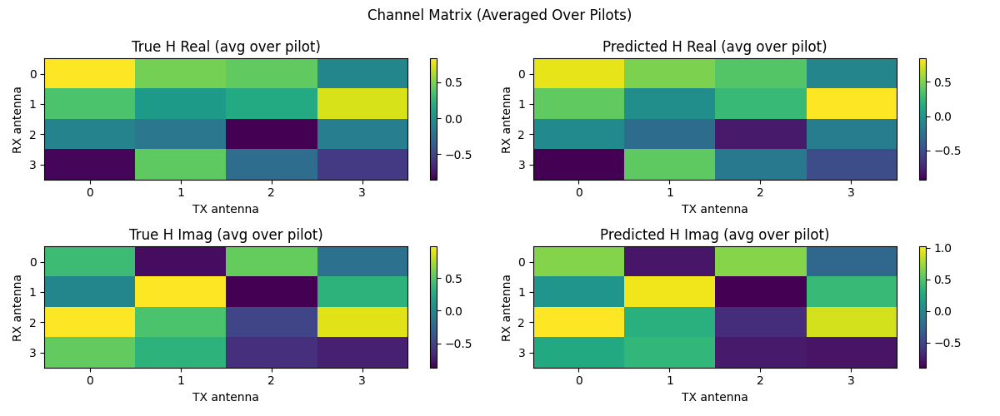
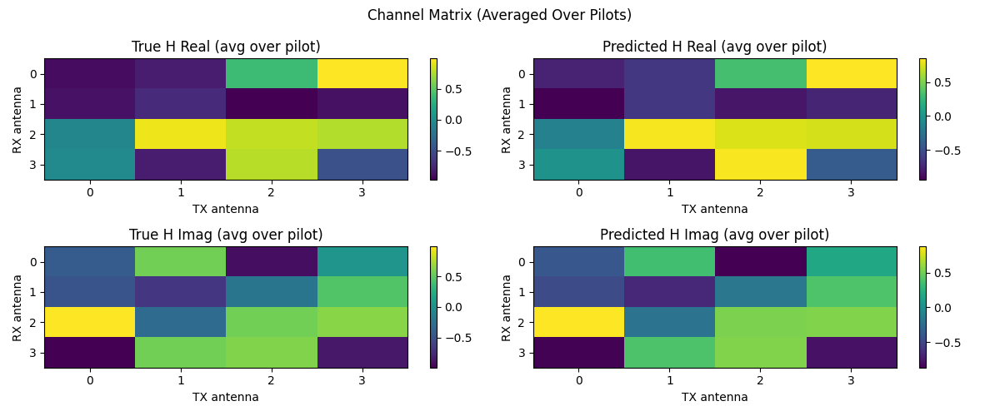

# 🛱 CSI Channel Estimation with Deep Learning

Channel State Information (CSI) Estimation in MIMO systems using lightweight deep learning models. This project implements compact neural networks (3D CNN, LSTM, Transformer) to estimate the channel matrix (H) from known pilot signals. These models significantly outperform a traditional MMSE estimator. Evaluation is conducted on two channel environments – a synthetic i.i.d. Rayleigh fading channel and a realistic DeepMIMO ray-tracing channel – to highlight generalization and robustness across channel conditions.

---

## 🧠 Project Highlights

* 📶 **Multiple Channel Scenarios**: Supports synthetic Rayleigh fading (uncorrelated i.i.d. channels) and DeepMIMO ray-tracing data (real-world geometry with spatial correlation). This tests the models on both idealized and real-world channel characteristics.
* 🧹 **Three Model Architectures**: Implemented 3D CNN, LSTM, and Transformer based estimators (each \~80K parameters) to learn CSI mapping from pilots.
* 🧪 **MMSE Baseline Comparison**: Benchmarked against a traditional MMSE channel estimator under realistic conditions (varying SNR, hardware impairments) to quantify gains.
* 📈 **Rich Visualizations**: Includes training loss curves, channel heatmaps (true vs. predicted H), and residual histograms of estimation error. These help interpret model performance per antenna and overall error distribution.
* ⚡ **Deployment Focus**: Measured CUDA GPU inference time for each model (batch size 1 and 32) to assess real-time deployment feasibility.

---
## 🧩 Design Highlights & Summary

This project demonstrates that a lightweight **2-layer 3D CNN** is sufficient to outperform traditional MMSE estimators and deeper models like LSTM and Transformer in both accuracy and inference time. The CNN architecture is carefully selected for:

- **Practical Deployability**: With only two 3D convolutional layers and a final 1×1×1 output convolution, the model remains extremely lightweight (~80K parameters) and well-suited for edge deployment.

- **Architecture Comparison**:
  - **CNN**: 2 Conv3D layers + ReLU + final Conv3D(1×1×1)
  - **LSTM**: 2-layer LSTM + 1 FC layer
  - **Transformer**: 2 Transformer encoder blocks + 1 FC layer

After extensive benchmarking, the CNN-based estimator emerges as the best choice:

- ✅ Lowest validation MSE across both Rayleigh and DeepMIMO channels  
- ✅ Fastest inference speed on GPU (0.37ms at batch=1)  
- ✅ Strong generalization even under varying SNR and channel conditions

This shows that a well-designed, compact CNN architecture not only simplifies deployment but also delivers state-of-the-art performance.
---
## 🖐 System Model

We aim to estimate the MIMO channel matrix **H** using known pilot **x** and observed signal **y** under AWGN:

```
y = H · x + n
```

Where:

- **x**: known pilot symbols, shape `(N_tx × L × 2)` — includes real and imaginary parts  
- **y**: received signal, shape `(N_rx × L × 2)` — includes real and imaginary parts  
- **H**: channel matrix, shape `(N_rx × N_tx × L × 2)` — complex-valued channel coefficients  
- **n**: additive white Gaussian noise

Each training sample represents a single CSI frame – we use L = 8 pilot subcarriers (spanning 8 frequencies in one OFDM symbol, similar to 5G NR CSI-RS patterns). The model learns to predict **Ĥ** (estimated H) from the input pair (x, y).

*Intuition*: The channel matrix H describes how each transmit antenna’s signal propagates to each receive antenna. Our neural networks learn to recover this matrix from the distorted pilot signals received, effectively learning the complex gain and phase introduced by the channel.

---

## 🌐 Channel Modeling: Rayleigh vs DeepMIMO

| Feature            | Rayleigh Channel                  | DeepMIMO (O1\_60)                          |
| ------------------ | --------------------------------- | ------------------------------------------ |
| Fading Model       | i.i.d. Complex Gaussian `CN(0,1)` | Ray-traced from real-world geometry        |
| Multi-path effect  | No (single tap)                   | Yes (multiple paths with delay & AoA/AoD)  |
| TX/RX correlation  | None                              | Present due to spatial layout              |
| Temporal diversity | No (flat response across pilots)  | Yes (each pilot gets distinct path phases) |
| Structure          | Uncorrelated, unstructured        | Geometrically constrained, structured      |
| Use case           | Baseline sanity test              | Realistic deployment setting               |
### 🔬 Power Delay Profile (PDP) Characteristics

**Rayleigh channel** is generated with exponential decay per tap:

```
h_l ~ CN(0, σ² · e^(–α·l))
```

**DeepMIMO channel** aggregates multiple geometric paths:

```
H(f) = Σₚ √(Pₚ) · e^(–j·2π·f·τₚ) · e^(j·ϕₚ) · a_rxₚ · a_txₚᴴ
```

Where:

* Pₚ: power of the p-th propagation path
* τₚ: delay of the p-th path
* ϕₚ: random phase shift of the p-th path
* a\_rxₚ: receive array steering vector
* a\_txₚᴴ: transmit array steering vector (Hermitian)

To introduce diversity across pilots, each path is perturbed with:

* random carrier frequency phase
* AoA/AoD steering response

This makes each subcarrier carry **distinct spatial features**, allowing learning-based models to outperform MMSE.


---

## 🧪 Channel Data & Augmentations

We evaluate on two types of channel datasets, with on-the-fly augmentations to simulate real conditions:

* **Synthetic Rayleigh Fading**: Each channel coefficient `h_{i,j} ~ CN(0,1)` (complex Gaussian). All antenna pairs are i.i.d. with no correlation – essentially a "white noise" channel. This provides a simple, uncorrelated scenario to test generalization.

* **DeepMIMO Ray-Tracing (O1\_60)**: Channels generated from a 3D ray-tracing scenario (DeepMIMO dataset). Multipath propagation and environment geometry create inherent TX/RX spatial correlation and structured channel taps. This represents a realistic urban microcell, challenging the model to exploit correlation and structure in the channel.

* **Augmentations & Impairments**: To improve realism and robustness, each training sample applies random conditions:

  * **Random SNR (Signal-to-Noise Ratio)**: Uniform between 10–30 dB for each sample, adding appropriate noise power.
  * **Random Pilot Sequence**: Uses Zadoff-Chu sequences with a random root index for each sample (simulating different pilot designs).
  * **IQ Imbalance (optional)**: Can simulate transmitter/receiver IQ gain-phase imbalance on the signals.
  * **4-bit Quantization Noise (optional)**: Quantize the input signal to 4-bit resolution to simulate ADC constraints.


These augmentations ensure the models are exposed to a variety of conditions and are not overfitting to ideal scenarios.

---

## 🧠 Models Implemented

| Model                 | Description                                                                                                             |
| --------------------- | ----------------------------------------------------------------------------------------------------------------------- |
| **SimpleCSINet3D**    | 3D CNN that processes input as a volume across (Rx, Tx, pilots). \~80K params. Fast and effective for spatial features. |
| **LSTMCSINet**        | Treats pilots as sequential input. Captures frequency correlation. Best when channel response has structure across L.   |
| **TransformerCSINet** | Uses self-attention across pilot subcarriers. Learns global relationships among antennas and subcarriers.               |

**Input Format**: Each model receives input of shape `(batch, 4, N_rx, N_tx, L)`, where the 4 channels represent `[x_real, x_imag, y_real, y_imag]`. Real and imaginary parts of pilot and received signals are stacked along the channel dimension.

**Output Format**: The model outputs a predicted channel tensor Ĥ of shape `(batch, N_rx, N_tx, L, 2)`, where the last dimension contains the real and imaginary components of the estimated channel matrix. Uses attention to model long-range pilot relationships |

---

## 📊 Results & Visualizations

Below we present training results on both Rayleigh and DeepMIMO datasets for each model. We include:

- **Loss Curves**: Training vs. validation MSE loss across epochs. The dotted line indicates MMSE baseline.
- **Heatmaps**: Visual comparison of true vs. predicted channel magnitudes for a selected sample.
- **Residual Histograms**: Distribution of the element-wise difference between predicted and true channels.

| Dataset  | Model       | Loss Curve                                      | Heatmap                                       | Residual Histogram                                      |
| -------- | ----------- | ----------------------------------------------- | --------------------------------------------- | ------------------------------------------------------- |
| Rayleigh | CNN         |          |          |          |
| Rayleigh | LSTM        |         |         |         |
| Rayleigh | Transformer |  |  |  |
| DeepMIMO | CNN         |          |          |          |
| DeepMIMO | LSTM        |         |         |         |
| DeepMIMO | Transformer |  |  |  |

**Figure Interpretation**:

- In **loss curves**, a lower validation loss indicates better generalization. Dotted horizontal lines indicate MMSE baseline loss.
- In **heatmaps**, more similar color patterns between prediction and ground truth imply better spatial reconstruction.
- In **residual histograms**, an ideal model shows error distribution centered at 0 with tight spread (low variance).

### 📋 Performance Summary Table (Val MSE vs MMSE)

| Dataset  | Model       | Val MSE ↓  | MMSE MSE (Baseline) | Notes                                                                                   |
|----------|-------------|------------|----------------------|-----------------------------------------------------------------------------------------|
| Rayleigh | **CNN**     | **0.0144** | 0.0297               | Best overall on Rayleigh; clean and stable convergence.                                 |
| Rayleigh | LSTM        | 0.0391     | 0.0295               | Underfits; sequential modeling ineffective for uncorrelated i.i.d. channels.            |
| Rayleigh | Transformer | 0.0186     | 0.0298               | Improved performance after epoch 7; good generalization.                                |
| DeepMIMO | **CNN**     | **0.0075** | 0.0369               | 🏆 **Best overall** (5× lower MSE than MMSE); highly effective at exploiting correlation.|
| DeepMIMO | LSTM        | 0.0195     | 0.0373               | Performs reasonably well but less consistent than Transformer.                          |
| DeepMIMO | Transformer | 0.0130     | 0.0375               | Strong results; benefits from structured multipath diversity.                           |


### 🎯 Model Selection Insight

💡 **Key Takeaways**

- **LSTM Underfits (Not Overfitting)**  
  The LSTM model shows validation loss lower than training loss in both Rayleigh and DeepMIMO scenarios, indicating no overfitting. Instead, it likely underfits due to an architecture-data mismatch:  
  - The Rayleigh channel has no sequential structure (each subcarrier fading is independent), so LSTM’s time-series modeling offers little benefit.  
  - Aggressive dropout further reduces capacity, leading to under-utilization of the model.

- **Transformer Shows Delayed Gain**  
  The Transformer model often plateaus early (e.g., Rayleigh), then improves significantly after ~7–8 epochs. This suggests attention weights need more time to adapt.  
  - In DeepMIMO (with more inherent structure), Transformer converges smoothly and consistently outperforms LSTM.

- **3D CNN Excels**  
  Emerges as the best performer across both datasets. Achieves lowest MSE with stable, fast convergence.  
  - Especially in DeepMIMO, CNN reduces MSE from MMSE's 0.0369 to 0.0075 — nearly **5× lower**, showing strong ability to capture spatial-frequency features.

- **Dropout Impact**  
  Dropout layers in CNN caused a noticeable train–val gap.  
  - Removing dropout led to tighter convergence and better generalization, suggesting models weren’t overfitting and regularization was unnecessary.


---
### ✅ Future Improvements (Action Items)

- **ResNet-based Estimator**  
  Experiment with a ResNet-style deep CNN to explore whether skip connections can further improve estimation accuracy.

- **Longer Pilot Sequences**  
  Evaluate model robustness using longer pilot lengths (more subcarriers or time slots). This may allow LSTM/Transformer to leverage true sequential structure more effectively.

- **More DeepMIMO Scenarios**  
  Test on additional DeepMIMO scenes (e.g., O1_28, O2_60) to confirm generalization across different spatial layouts and carrier frequencies.

- **Transformer Tuning**  
  Adjust Transformer hyperparameters (e.g., insert LayerNorm, increase depth) to potentially close the performance gap with CNN on Rayleigh channels.

---
## 🔬 Inference Time (CUDA, batch size = 1/32)
We benchmarked the models' forward-pass inference latency on a single NVIDIA GPU (PyTorch, FP32). Even with similar parameter counts, architecture differences affect speed:
| Model       | Inference Time (ms) |
| ----------- | ------------------- |
| CNN         | 0.37 / 0.50         |
| LSTM        | 0.44 / 0.85         |
| Transformer | 0.83 / 1.13         |
Notes: The CNN is fastest, especially at batch=32 where it likely benefits from convolution parallelism. The Transformer is relatively slower due to attention computation overhead, which grows with sequence length (L=8 here is small, but still noticeable). LSTM is in between, but doesn’t scale as well to batch processing as CNN.
---

## 📁 Project Structure

```
CSI_Estimator_With_MMSE/
├── main.py               # Training & evaluation pipeline (argument parsing, logging)
├── model.py              # Model definitions for CNN, LSTM, Transformer
├── dataset.py            # Dataset generator for Rayleigh and DeepMIMO channels
├── mmse_baseline.py      # MMSE estimator implementation for comparison
├── generate_deepmimo.py  # Script to generate DeepMIMO channel matrix data from DeepMIMO dataset files
├── run_all_combinations.py # Helper to run all model/dataset experiments in batch
├── config.py             # Centralized configuration (hyperparameters, flags)
├── results/              # Folder for output plots (loss curves, heatmaps, histograms)
│   ├── Rayleigh_cnn_LossCurve.png, ...           # Training/validation loss plots for each scenario
│   ├── Rayleigh_cnn_Heatmap.png, ...             # Heatmap of true vs predicted H for a sample
│   └── Rayleigh_cnn_ResidualHistogram.png, ...   # Histogram of estimation residuals
├── README.md             # *You are here* – project overview and results
└── (other files like *.mat, *.pkl, *.pt are git-ignored due to size)

```

---

## 🚀 How to Run

Follow the steps below to set up and run the project:

---

### 1️️ Install Dependencies

Make sure you're using **Python 3.8+**, then install the required packages:

```bash
pip install torch numpy matplotlib
```

---

### 2️️ Prepare Data

* For **Rayleigh**, no external data is needed.
* For **DeepMIMO**, download the dataset (e.g., O1\_60 scenario) from the [DeepMIMO website](https://www.deepmimo.net/) and update the path in `config.py`.

(Optional) To generate H matrix samples from CIR:

```bash
python generate_deepmimo.py
```

---

### 3️️ Train a Model

Run the training script with desired configuration:

```bash
python main.py --model=cnn --dataset=rayleigh
# options: --model=cnn/lstm/transformer
#          --dataset=rayleigh/deepmimo
```

Training progress and final metrics will be logged automatically.

---

### 4️️ Reproduce All Experiments

To run all 3 models on both datasets and generate results used in the README:

```bash
python run_all_combinations.py
```

Plots and metrics will be saved under the `results/` folder.


---

## MIT License

Copyright (c) 2025 Wang Chen Han

Permission is hereby granted, free of charge, to any person obtaining a copy  
of this software and associated documentation files (the “Software”), to deal  
in the Software without restriction, including without limitation the rights  
to use, copy, modify, merge, publish, distribute, sublicense, and/or sell  
copies of the Software, and to permit persons to whom the Software is  
furnished to do so, subject to the following conditions:

The above copyright notice and this permission notice shall be included in all  
copies or substantial portions of the Software.

THE SOFTWARE IS PROVIDED “AS IS”, WITHOUT WARRANTY OF ANY KIND, EXPRESS OR IMPLIED,  
INCLUDING BUT NOT LIMITED TO THE WARRANTIES OF MERCHANTABILITY, FITNESS FOR A  
PARTICULAR PURPOSE AND NONINFRINGEMENT. IN NO EVENT SHALL THE AUTHORS OR COPYRIGHT  
HOLDERS BE LIABLE FOR ANY CLAIM, DAMAGES OR OTHER LIABILITY, WHETHER IN AN ACTION  
OF CONTRACT, TORT OR OTHERWISE, ARISING FROM, OUT OF OR IN CONNECTION WITH THE  
SOFTWARE OR THE USE OR OTHER DEALINGS IN THE SOFTWARE.

---

## 👨‍💻 Author

**Wang Chen Han**  
5G PHY Algorithm Engineer  
[GitHub: HankWang-WL](https://github.com/HankWang-WL)  
Email: [hank851107@gmail.com](mailto:hank851107@gmail.com)

---
