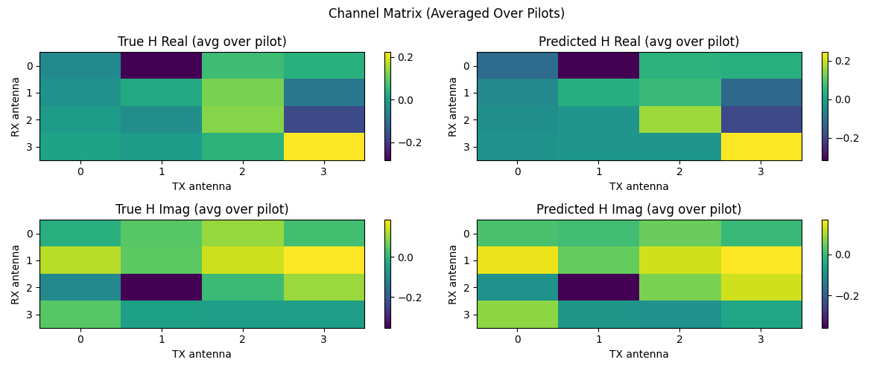
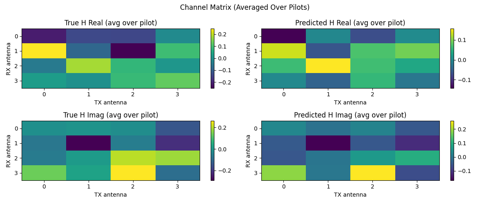
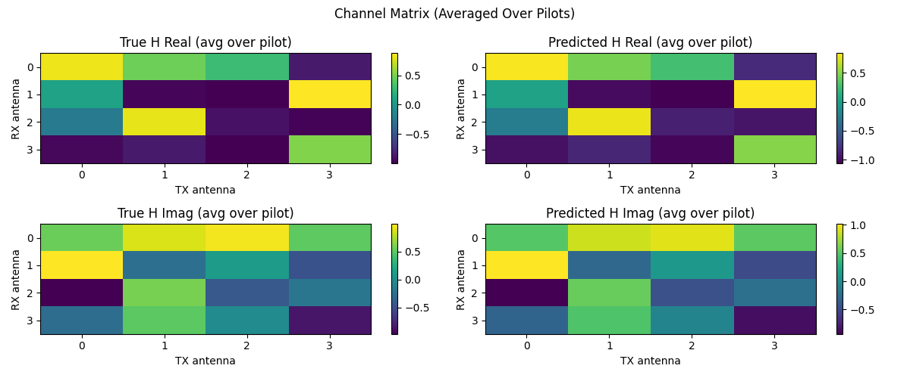
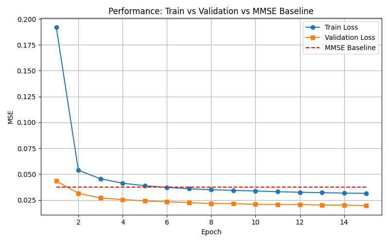
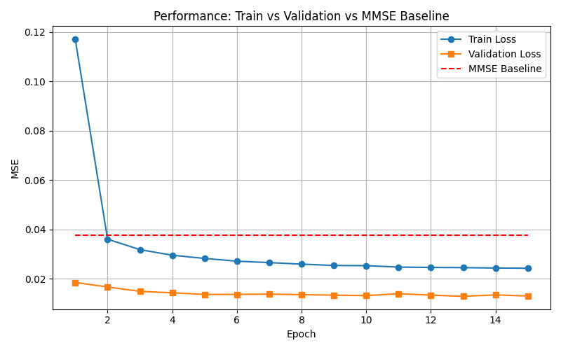

# 🛱 CSI Channel Estimation with Deep Learning

This project benchmarks lightweight deep learning models (3D CNN, LSTM, Transformer) for CSI (Channel State Information) estimation in MIMO systems. It compares the performance with traditional MMSE under synthetic Rayleigh and DeepMIMO-generated channels.

---

## 🧠 Project Highlights

* 📶 **Supports both synthetic Rayleigh and DeepMIMO ray-tracing datasets**
* 🧹 **Implements 3 model types**: 3D CNN, LSTM, Transformer
* 🧪 **Compares with MMSE baseline** under realistic noise & distortion
* 📊 **Includes visualizations**: heatmaps, per-antenna comparisons, loss curves
* ⚙️ **Benchmarking on CUDA inference time**: practical deployment focus

---

## 🖐 System Model

We estimate the MIMO channel matrix `H` using pilot signals `x`, with the received signal `y`:

```
y = H · x + n
```

Where:

* `x`: known pilot symbol, shape `(N_tx × L)`
* `y`: received signal at RX, shape `(N_rx × L)`
* `H`: channel tensor, shape `(N_rx × N_tx × L × 2)` where the last dim is \[real, imag]
* `n`: additive white Gaussian noise

Each training sample represents **a single CSI frame**, consisting of `L=8` pilot subcarriers (not time steps), following real-world CSI-RS usage in OFDM.

---

## 🧪 Channel Data & Augmentations

### Synthetic Rayleigh Channel

* Each element `h_{i,j}` \~ `CN(0, 1)`
* i.i.d. fading with no TX/RX correlation
* Simulates a "white" channel — ideal for testing generalization

### DeepMIMO (O1\_60)

* Geometry-based ray-tracing CSI from real-world layout
* Inherent **TX/RX correlation**, shared multi-path structure
* Useful to test model's ability to extract structured features

### Data Preprocessing & Augmentations

* Random SNR between 10–30 dB
* Random Zadoff-Chu pilot root index
* Optional IQ imbalance simulation
* 1-bit quantization noise (optional)

---

## 🧠 Models Implemented

| Model               | Description                                  |
| ------------------- | -------------------------------------------- |
| `SimpleCSINet3D`    | 3D CNN over (rx, tx, pilot), \~80K params    |
| `LSTMCSINet`        | Models pilot as a sequence, uses LSTM layers |
| `TransformerCSINet` | Uses attention across subcarriers            |

All models take input:

```
x_input: (batch, 4, N_rx, N_tx, L)  # 4 channels = [x_real, x_imag, y_real, y_imag]
```

Output:

```
Ĥ: (batch, N_rx, N_tx, L, 2)
```

---

## 📊 Result Highlights

### 🔁 Loss Curve (Train vs Val vs MMSE)

| Dataset  | Model       | Loss Curve                                      | Heatmap                                       | 1-sample Comparison                                     |
| -------- | ----------- | ----------------------------------------------- | --------------------------------------------- | ------------------------------------------------------- |
| Rayleigh | CNN         |          |          |          |
| Rayleigh | LSTM        |         |         |         |
| Rayleigh | Transformer |  |  |  |
| DeepMIMO | CNN         |          |          |          |
| DeepMIMO | LSTM        |         |         |         |
| DeepMIMO | Transformer |  |  |  |

### 📋 Performance Summary Table

| Dataset  | Model       | Val MSE ↓  | MMSE MSE ↑ | Notes                                  |
| -------- | ----------- | ---------- | ---------- | -------------------------------------- |
| Rayleigh | CNN         | **0.0139** | 0.0295     | Best overall. Clean convergence.       |
| Rayleigh | LSTM        | 0.0411     | 0.0296     | Poor fit. Lacks sequence structure.    |
| Rayleigh | Transformer | 0.0184     | 0.0295     | Better than LSTM. Sudden recovery.     |
| DeepMIMO | CNN         | **0.0040** | 0.0334     | 🏆 Best among all. Strong correlation. |
| DeepMIMO | LSTM        | 0.0077     | 0.0331     | Good but weaker than Transformer.      |
| DeepMIMO | Transformer | 0.0058     | 0.0331     | Better than LSTM. Smooth convergence.  |

### 💡 Key Takeaways

- **🧠 LSTM is not overfitting – it's underfitting**  
  Both in Rayleigh and DeepMIMO, **validation loss is lower than training loss**, showing no sign of overfitting. Instead, LSTM likely **underfits** due to a mismatch between architecture and data:  
  - Rayleigh has no temporal correlation, making sequential modeling ineffective  
  - Dropout might further suppress learning capacity

- **⚡ Transformer surprises**  
  In Rayleigh, the model initially plateaus but sharply improves after epoch 8, likely due to **late-stage attention adaptation**. In DeepMIMO, it converges more smoothly and **outperforms LSTM consistently**.

- **🎯 CNN is best-in-class**  
  Across all setups, 3D CNN performs the best with **fast convergence and strong generalization**. In DeepMIMO, it **beats MMSE by nearly 10× margin** (MSE: 0.0040 vs 0.0334).

- **💥 Dropout worsens fit**  
  Dropout leads to **train-val loss gaps**, especially in simpler models like CNN. Disabling dropout yields **faster convergence and tighter fit**, as verified in CNN experiments.

---

### ✅ Action Items

* [ ] Add ResNet-based CSI Estimator
* [ ] Conduct robustness test on longer pilot
* [ ] Add multiple DeepMIMO scenarios (O1\_28, O2\_60)
* [ ] Re-try Transformer with layer norm tuning

---

## 🔬 Inference Benchmark (CUDA)

| Model       | Batch Size | Inference Time (ms) |
| ----------- | ---------- | ------------------- |
| CNN         | 1          | 0.369               |
| LSTM        | 1          | 0.439               |
| Transformer | 1          | 0.828               |
| CNN         | 32         | 0.499               |
| LSTM        | 32         | 0.848               |
| Transformer | 32         | 1.137               |

---

## 📁 Project Structure

```
CSI_Estimator_With_MMSE/
├── main.py                # Training & evaluation pipeline
├── model.py               # CNN / LSTM / Transformer model definitions
├── dataset.py             # CSI dataset loader (Rayleigh / DeepMIMO)
├── mmse_baseline.py       # MMSE estimator baseline
├── config.py              # Centralized config parameters
├── generate_deepmimo.py   # DeepMIMO CIR -> H data converter
├── run_all_combinations.py # Auto run 3x2 (model × dataset) experiments
├── README.md              # This file
├── .gitignore             # Git-ignored patterns
└── results/               # 📊 All visual results (.png)

Ignored:
  ├── *.mat, *.pkl, *.pt         # Large data or model weights
  ├── __pycache__/
  └── myenv310/
```

---

## 🚀 How to Run

Install dependencies:

```bash
pip install torch numpy matplotlib
```

Run training:

```bash
python main.py
```

Use DeepMIMO:

```bash
python generate_deepmimo.py
```

---

## 📜 License

This repository is released under the MIT License. You are free to use, copy, modify, and distribute this project for any purpose.

```
MIT License
Copyright (c) 2025 Wang Chen Han

Permission is hereby granted, free of charge, to any person obtaining a copy
of this software and associated documentation files (the “Software”), to deal
in the Software without restriction, including without limitation the rights
to use, copy, modify, merge, publish, distribute, sublicense, and/or sell
copies of the Software.

THE SOFTWARE IS PROVIDED “AS IS”, WITHOUT WARRANTY OF ANY KIND.
```

---

## 👨‍💻 Author

**Wang Chen Han（王振翰）**
5G PHY Algorithm Engineer
GitHub: [github.com/HankWang-WL](https://github.com/HankWang-WL)
Email: [hank851107@gmail.com](mailto:hank851107@gmail.com)
